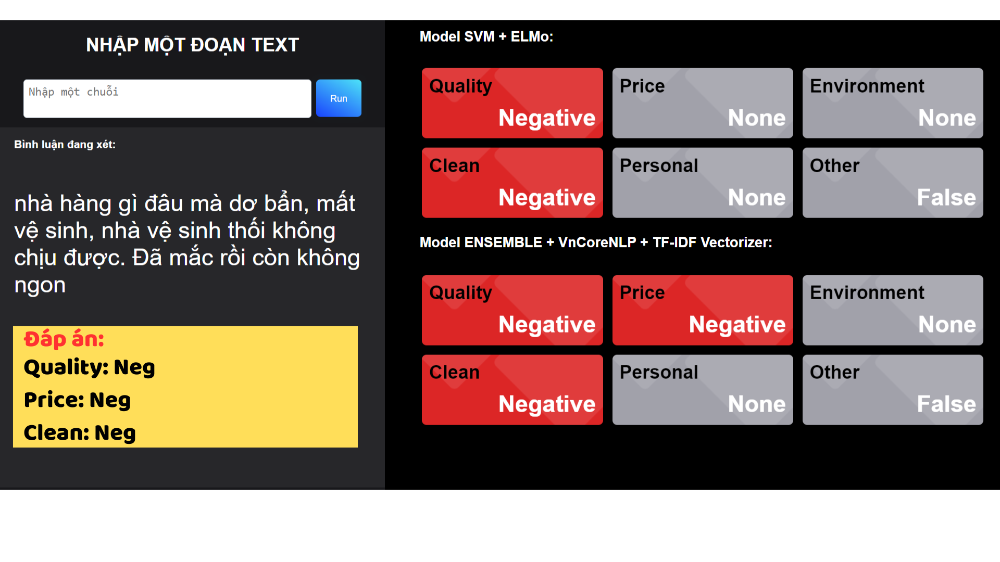
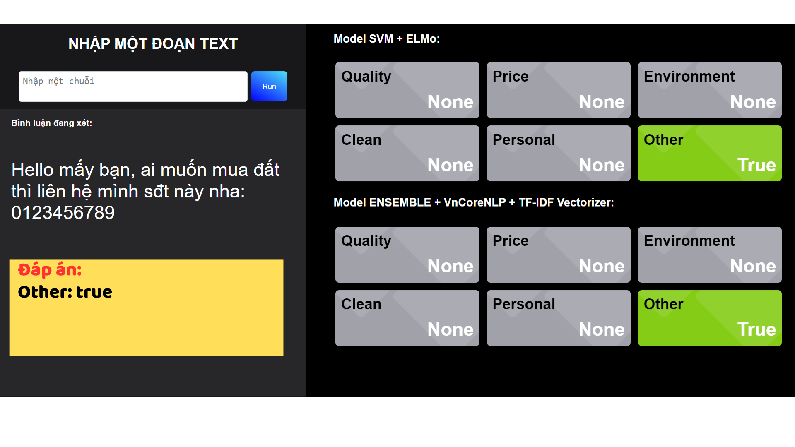
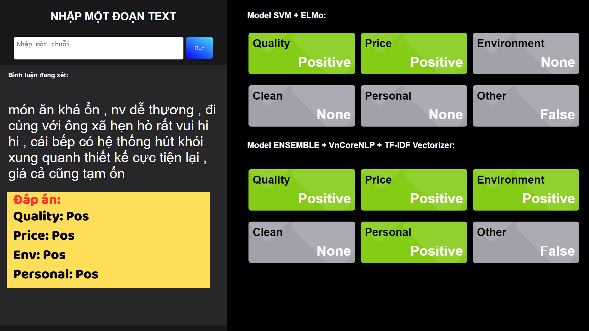
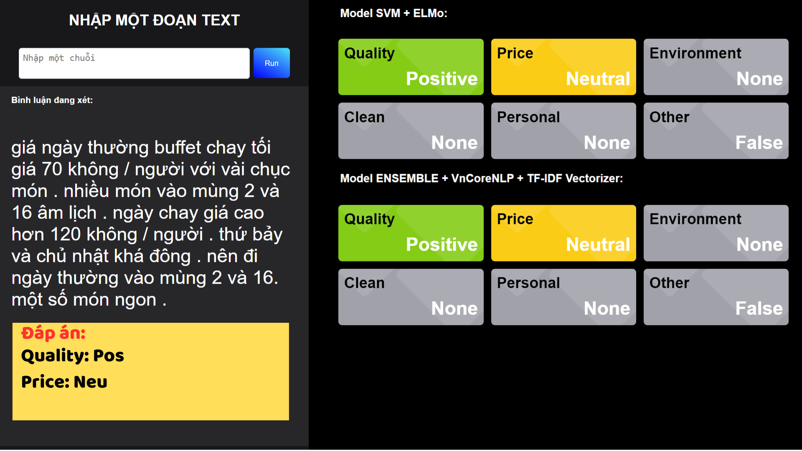
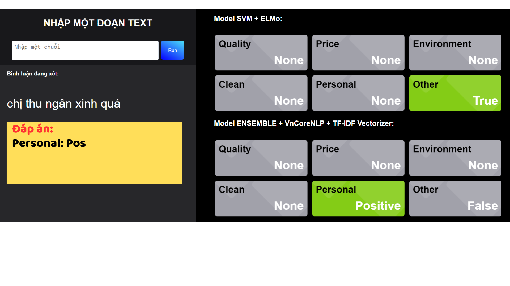
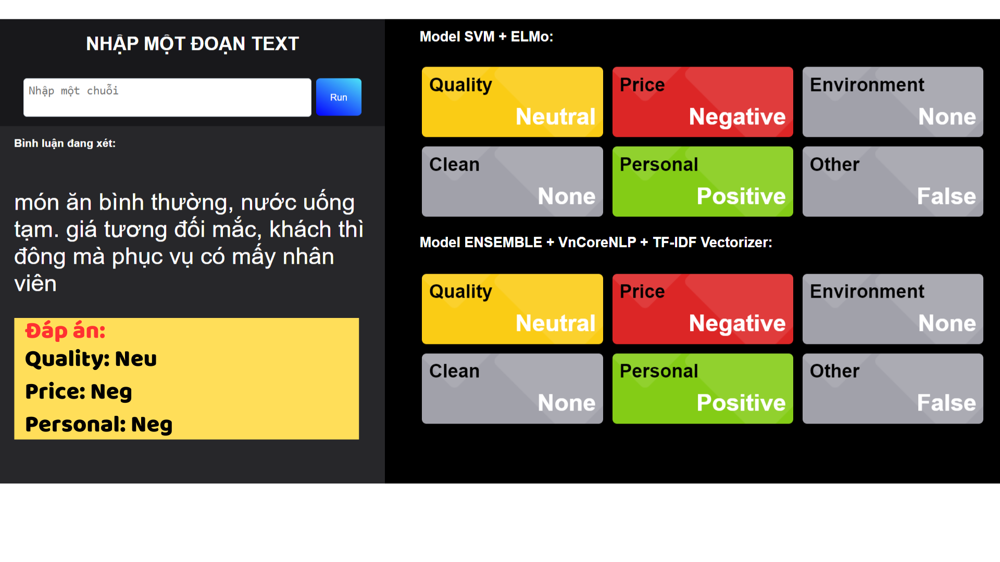
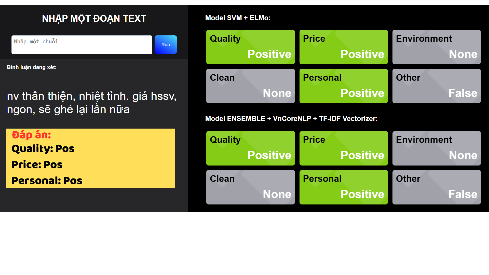
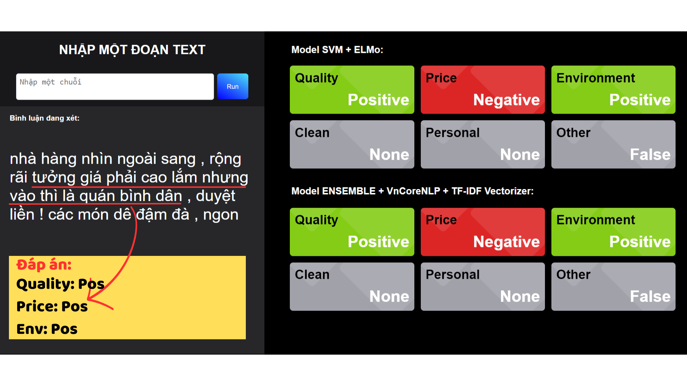

# Các lưu ý trước khi chạy ứng dụng
Do giới hạn 1GB băng thông của chính sách Git LFS (bản free) nên file ```embedding_matrix.csv``` và file ```svm_model.pkl``` thường không được clone về cùng.

Vì vậy, sau khi clone repo về, kiểm tra trong thư mục Model_SVM có đầy đủ các 5 file này hay không 


Nếu không đầy đủ, truy cập vào https://drive.google.com/drive/folders/1BOrByYy9RzsR5SLVXcgakibflR11X9T9 và tải bổ sung các file về thư mục Model_SVM

# Hướng dẫn cài đặt và chạy ứng dụng

Mở hộp thoại cmd (Command Prompt). 

*Lưu ý: Sử dụng PowerShell của Visual Code không khởi tạo môi trường ảo được.*

## Bước 1: Khởi tạo môi trường ảo
```bash
python -m venv venv
```

## Bước 2: Kích hoạt môi trường ảo

- Trên Windows
```
venv\Scripts\activate

```

- Trên IOS
```
source venv/bin/activate

```

## Bước 3: Cài đặt các gói cần thiết

```
pip install -r requirements.txt

```

## Bước 4:  Chạy ứng dụng
```
python app.py
```

Sử dùng trình duyệt bất kỳ, truy cập ```http://127.0.0.1:5000```

Hình ảnh trực quan hóa
       
